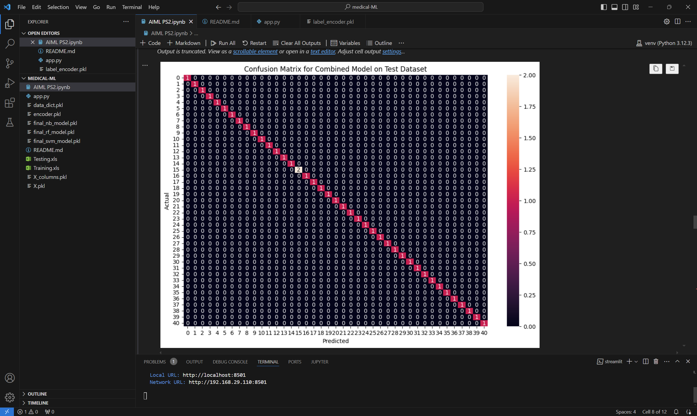
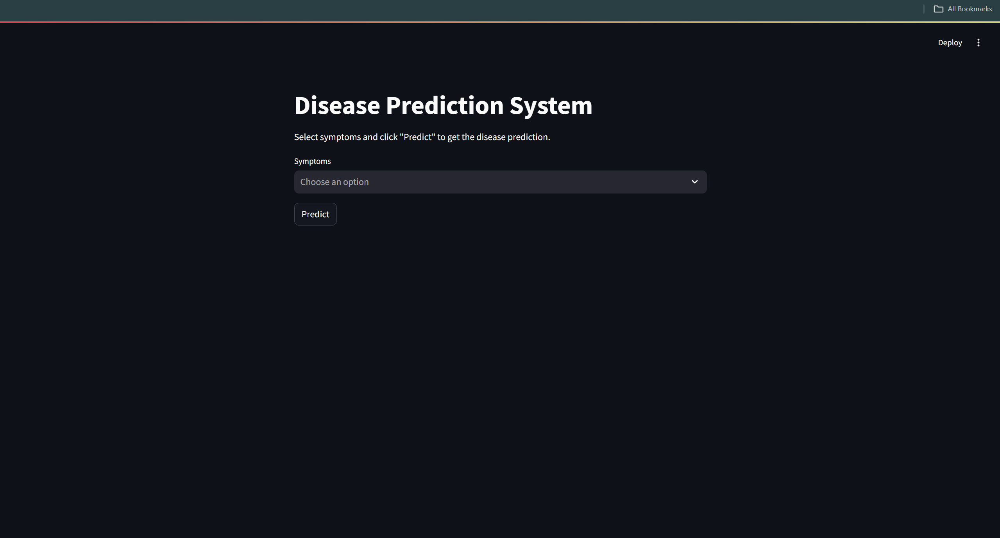
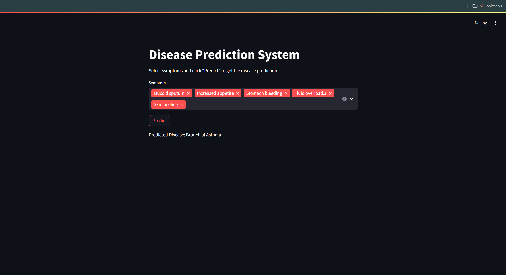
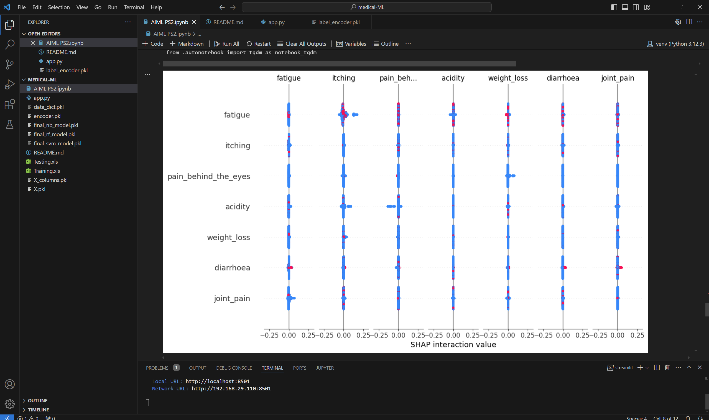

# Disease Prediction System using Machine Learning

## Shubham Chakraborty
## Project Overview
The "Disease Prediction System using Machine Learning" aims to develop an intelligent system that predicts the likelihood of a person having a particular disease based on various health-related features. This system utilizes machine learning algorithms to analyze historical health data and make predictions, contributing to early disease detection and proactive healthcare management.

## Table of Contents
1. [Project Overview](#project-overview)
2. [Project Details](#project-details)
3. [Installation](#installation)
4. [Usage](#usage)
5. [Data Collection](#data-collection)
6. [Data Preprocessing](#data-preprocessing)
7. [Feature Selection](#feature-selection)
8. [Model Development](#model-development)
9. [Cross-Validation](#cross-validation)
10. [Hyperparameter Tuning](#hyperparameter-tuning)
11. [Model Interpretability](#model-interpretability)
12. [User Interface](#user-interface)
13. [Integration with Electronic Health Records (EHR)](#integration-with-electronic-health-records-ehr)
14. [Documentation](#documentation)
15. [Validation and Testing](#validation-and-testing)
16. [Contributing](#contributing)
17. [License](#license)
18. [Screenshots](#screenshots)

## Project Details
**Domain:** Artificial Intelligence and Machine Learning  
**Project Name:** Disease Prediction System  
**Level:** Intermediate  

## Installation
1. Clone the repository:
    ```sh
    git clone https://github.com/yourusername/medical-ML.git
    cd medical-ML
    ```
2. Create a virtual environment:
    ```sh
    python -m venv venv
    source venv/bin/activate   # On Windows: venv\Scripts\activate
    ```
3. Install the required packages:
    ```sh
    pip install -r requirements.txt
    ```

## Usage
**Training and Saving Models:**
- Ensure your dataset is available in the `dataset` directory.
- Run the Jupyter Notebook to train models and save them:
    ```sh
    jupyter notebook
    # Open and run the notebook to train and save the models
    ```

**Running the Streamlit App:**
- Run the Streamlit application:
    ```sh
    streamlit run app.py
    ```
- Open your browser and go to `http://localhost:8501`.

## Data Collection
The dataset used for this project was obtained from Kaggle: [Disease Prediction Using Machine Learning](https://www.kaggle.com/datasets/kaushil268/disease-prediction-using-machine-learning). The dataset contains various health-related features including age, gender, BMI, blood pressure, cholesterol levels, and family medical history.

## Data Preprocessing
Data preprocessing involved several steps to ensure the quality and usability of the data:
- **Handling Missing Values:** Identified and filled missing values using appropriate imputation techniques.
- **Outlier Detection and Removal:** Detected outliers using statistical methods and removed them to prevent skewing the model.
- **Feature Scaling:** Normalized and standardized features to ensure they are on a consistent scale, which helps improve the performance of machine learning algorithms.

## Feature Selection
Feature selection techniques were employed to identify the most influential variables for disease prediction:
- **Correlation Matrix:** Analyzed the correlation between features to identify and remove redundant features.
- **Recursive Feature Elimination (RFE):** Used RFE with cross-validation to select the top features that contribute significantly to the model's accuracy.

## Model Development
Several machine learning algorithms were explored and implemented for disease prediction:
- **Logistic Regression:** Used for binary classification problems.
- **Decision Trees:** Provided a clear visualization of the decision-making process.
- **Random Forests:** An ensemble method that improves prediction accuracy by combining multiple decision trees.
- **Support Vector Machines (SVM):** Used for classification tasks to find the optimal hyperplane that separates data into classes.

## Cross-Validation
Cross-validation techniques were implemented to assess the generalization performance of the models and mitigate overfitting:
- **K-Fold Cross-Validation:** Split the dataset into k subsets, trained the model on k-1 subsets, and validated it on the remaining subset. This process was repeated k times.

## Hyperparameter Tuning
Hyperparameter tuning was performed to optimize the performance of the machine learning models:
- **Grid Search:** Exhaustively searched over specified parameter values for an estimator.
- **Random Search:** Performed random combinations of the hyperparameters to find the best model performance.

## Model Interpretability
Model interpretability was enhanced to provide insights into the factors influencing the predictions:
- **SHAP (SHapley Additive exPlanations):** Used SHAP values to explain the output of the machine learning models.
- **Feature Importance Plots:** Visualized the importance of each feature in the model.

## User Interface
A user-friendly interface was developed using Streamlit that allows users to input their health-related data and receive predictions about the likelihood of having a particular disease.

## Integration with Electronic Health Records (EHR)
The integration of the disease prediction system with electronic health records was explored, facilitating seamless information flow between healthcare providers and the system.

## Documentation
Comprehensive documentation covering data sources, methodology, model architecture, and instructions for using the prediction system was provided.

## Validation and Testing
Extensive testing and validation were conducted to ensure the accuracy, reliability, and robustness of the disease prediction system:
- **Confusion Matrix:** Evaluated the performance of the model.
- **Classification Report:** Detailed precision, recall, and F1-score metrics.

## Contributing
Contributions are welcome! Please fork the repository and submit a pull request.

## License
This project is licensed under the MIT License.

## Screenshots
Include screenshots of your application below:

### Confusion Matrix for Combined Model on Test Dataset


### Top 20 Feature Importances for Disease Prediction


### Home Page of the Application


### Selecting Symptoms


### SHAP Interaction Values


### Symptoms

